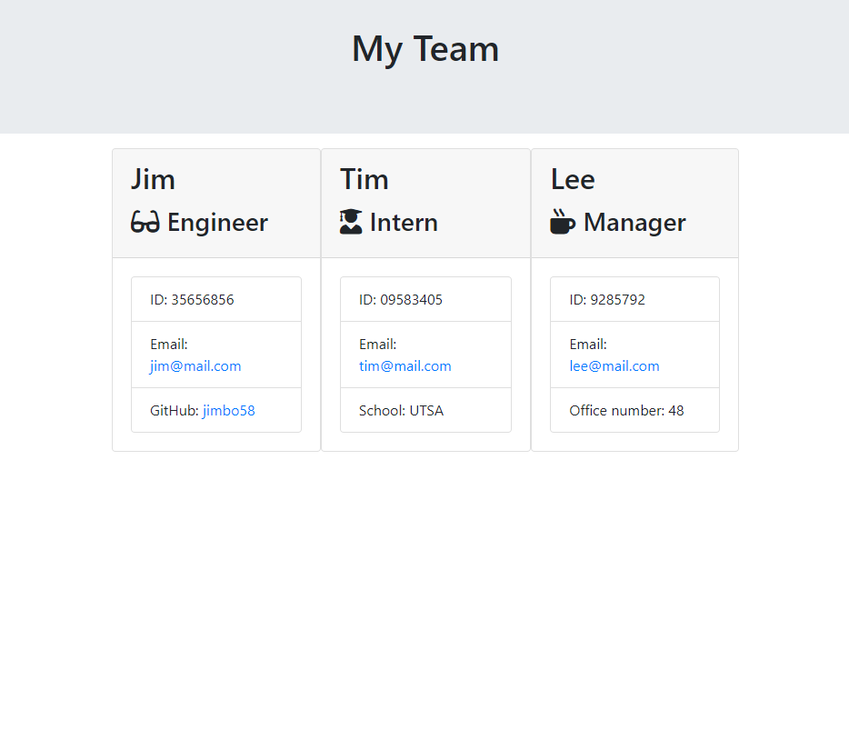
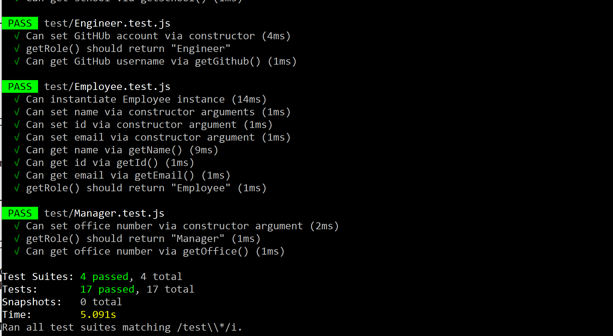

# Homework-10-Template-Engine

## Author

Celine Ross

## Description

Using Node and server-side javascript, I've created an app that can generate cards of employee information using a prompt-input system in a CMD console.

## Screenshot

## Requirements

Inquirer, Jest

## Installation

Requires an overall npm install, jest, and inquirer.

## Usage

After installing your required packages, you will be prompted to choose from an engineer, an intern, or a manager. Specialized questions will follow and then be displayed onto an html page.

## Contribution

Please contact me if you'd like to contribute to this project.

## Tests

4 test suites, all tests within passed.

